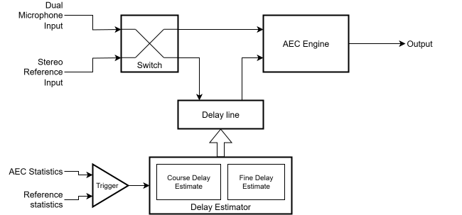
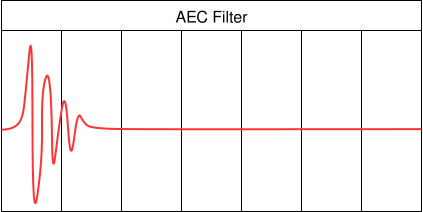
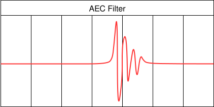
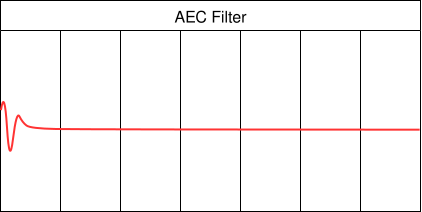
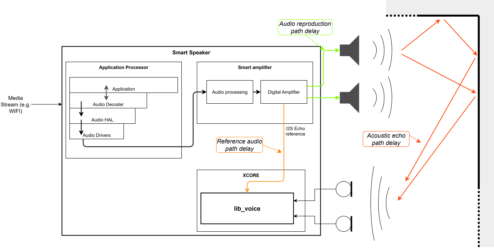
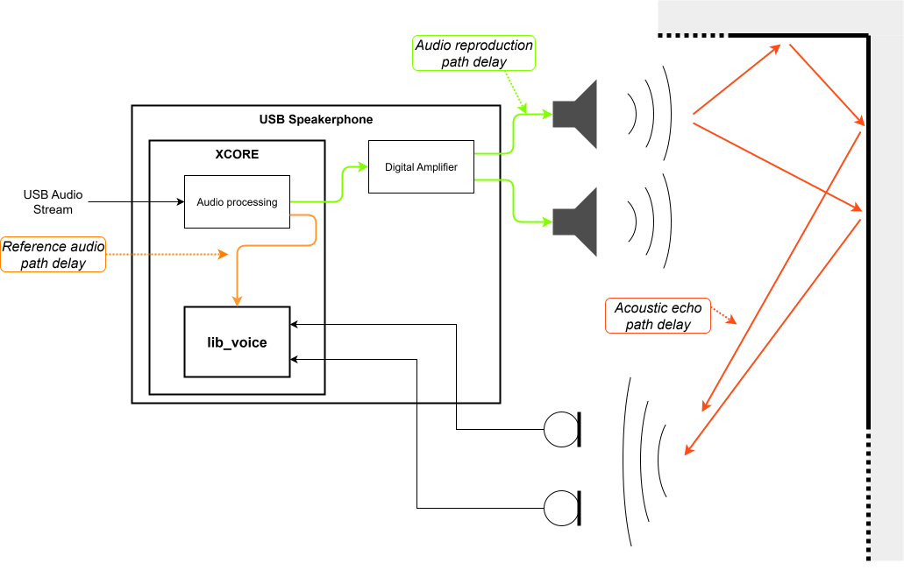
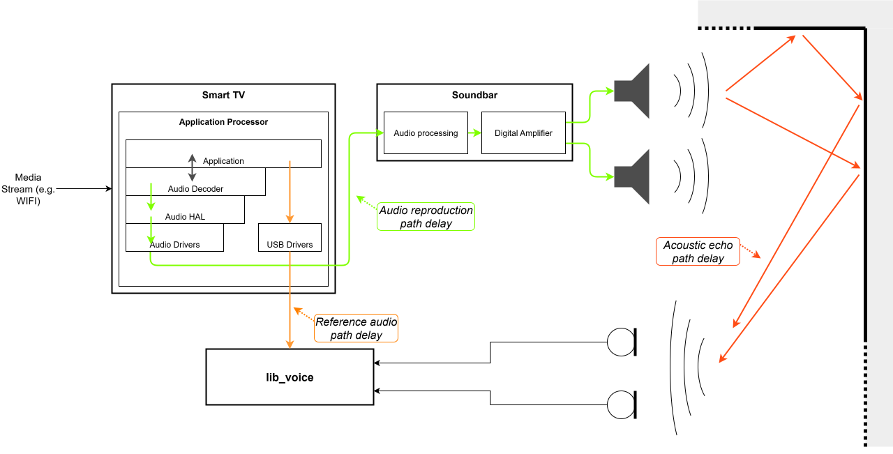

.. _adec_module:

Automatic Delay Estimation and Correction
=========================================

The Automatic Delay Estimation and Correction (ADEC) module provides functions to estimate and
automatically correct for delay offsets between the reference and the
loudspeakers. ADEC is designed to be used in combination with an :ref:`aec_module`.

The ADEC module provides functionality for 

* Measuring the current delay
* Using the measured delay along with AEC performance related metadata collected from the echo
  canceller to monitor AEC and make decisions about reconfiguring the AEC and correcting bulk
  delay offsets.

The basic topology of ADEC is shown in :numref:`adec_basics`. ADEC requests a delay correction
value that the application can use to insert delay into either the reference or microphone signal
path. When the loudspeaker signal lags behind the reference signal, the application should delay
the reference channel. When the reference signal lags behind the loudspeaker, the application
should delay the microphone channel.

.. _adec_basics:

    The basic topology of ADEC. ADEC allows the relative delay between the microphone and
    reference signals to be estimated and corrected.

AEC delays
----------

The time window modelled by the Acoustic Echo Canceller (AEC) is finite due to the filter tail length.
To maximise its performance it is important to ensure that the reference audio is presented to the
AEC time aligned to the audio being reproduced by the loudspeakers.
:numref:`adec_well_aligned` shows a well aligned AEC filter, where the whole impulse response is
captured. :numref:`adec_poorly_aligned` and :numref:`adec_off_front` show examples of poorly
aligned AEC filters where the reference audio arrives either too early or too late with respect to
the microphone signal, resulting in a start of the filter filled with zeros or the loss of the tail
of the impulse response.

.. _adec_well_aligned:

    In this AEC filter, the reference signal and microphone signal are well aligned, and the full
    impulse response is captured within the filter.

.. _adec_poorly_aligned:

    In this AEC filter, the reference signal arrives before the microphone signal, the start of the
    filter is filled with zeros and the tail of the impulse response is lost.

.. _adec_off_front:

    In this AEC filter, the microphone signal arrives before the reference signal, and the start of
    the impulse response is lost.

Since the time window modelled by the AEC is finite, to maximise its performance it is important to
ensure that the reference audio is presented to the AEC time aligned to the audio being reproduced
by the loudspeakers. The reference audio path delay and the audio reproduction path delay may be
significantly different, requiring additional delay to be inserted into one of the two paths, to
correct this delay difference. This can be achieved by either using a fixed delay or ADEC,
depending on the system design.

Systems not requiring ADEC
--------------------------

In an ideal system design, the relative delay between the reference audio and microphones is well
known and fixed. In these systems ADEC should not be used, and a fixed delay should be applied to
either the reference or microphone signals to ensure they are time aligned at the input of the AEC.
Examples of systems that do not need ADEC are shown in :numref:`adec_ideal_i2s_system` and
:numref:`adec_ideal_usb_system`. In both these systems, a fixed delay can be used instead.

.. _adec_ideal_i2s_system:

    In this system, the reference audio is sent to the XCORE device over I2S from the smart amplifier
    chipset. This will result in a well defined and fixed delay between the reference audio and the
    microphone signals, which can be compensated for by applying a fixed delay to either the
    reference or microphone signals as required, without the need for ADEC.

.. _adec_ideal_usb_system:

    In this system, the reference audio is sent to the XCORE device over USB from a host device,
    and the XCORE device sends the signal to the amplifier and loudspeakers. A duplicate of the
    signal is sent to the AEC. The timing over USB may vary, but the relative delay between the
    loudspeaker and microphone signals is fixed, so ADEC is not required.

Systems requiring ADEC
----------------------

In some applications, it is not possible to know the relative delay between the reference audio and
microphone signals, or the delay may vary over time. For example, in a Smart TV, the audio may be
played out of the TV's internal loudspeakers or an external soundbar, and the delay will be
different in these two scenarios. An example of this system is shown in
:numref:`adec_variable_usb_system`. In these applications, ADEC can be used to ensure the reference
and microphone signals remain time aligned at the input of the AEC, even when the delay changes.

.. _adec_variable_usb_system:

    In this system, the reference audio is sent to the XCORE device over USB from a host device.
    The audio reproduction path goes through the Smart TV's internal drivers, before being
    processed in the soundbar. Different models of soundbar would have different latencies, and the
    latency may also change based on the TV's audio settings, so the relative delay between the
    reference and microphone signals may be unknown and variable, requiring ADEC to maintain time
    alignment at the input of the AEC.

Overview
--------

Automatic delay estimation can either be triggered at power-up, manually if the host system
configuration changes, or automatically when the AEC performance degrades due to delay changes in
the system. For most applications (where a fixed delay cannot be used) it is recommended to enable
ADEC on boot, so that the AEC starts with the correct delay and can converge as quickly as possible.

It is advised to only enable the automatic mode of ADEC if it cannot be predicted when delay
changes will occur. This is because the automatic mode relies on monitoring the AEC performance and
can take some time to react to delay changes, during which the AEC performance may be poor. If the
system design allows, it is recommended to trigger delay estimation manually when a delay change is
expected, for example by sending a command from the host when the user changes the TV's audio
output settings.

Processing flow
---------------

The ADEC process will not begin until the reference signal is present and has sufficient energy.

During normal operation, ADEC monitors the AEC performance and can make decisions about when to
apply delay corrections based on the estimated delay and the AEC performance related metadata
collected from the echo canceller. 
The metadata collected from AEC contains statistics such as the ERLE, the peak power seen in the
adaptive filter and the peak power to average power ratio of the adaptive filter. ADEC uses the
metadata to measure the AEC goodness, and will modify the delay if the goodness falls.

Possible causes that may trigger an estimation cycle (where automatic mode is enabled):

- Host changing applications causing a delay change between loudspeakers and reference.
- Large volume changes between the reference and the loudspeaker play-back.
- User equipment changes, such as switching from TV audio output to playing the audio through a
  soundbar.

If the goodness falls, ADEC will first try to correct the delay by applying a small delay
correction to the input of the echo canceller. 

If the goodness does not improve after the small delay correction, ADEC will transition to delay
estimation mode. The delay estimation process re-purposes the AEC to detect larger delays. During
estimation, the AEC does not perform cancellation. On entering delay estimation, ADEC requests:

* A special delay to be applied at AEC input that will enable measuring the actual delay in both
  delay scenarios; microphone input arriving at the AEC earlier in time than the reference input as
  well as microphone input arriving late in time with respect to the reference input.
* A restart of AEC in a new configuration that has more adaptive filter phases, in order to have a
  longer filter tail length that is suitable for delay estimation.

Once the ADEC has a measure of the new delay, it requests a delay correction and a reconfiguration
of the AEC back to its normal mode. The AEC restarts and reconverges based on the corrected delay,
and ADEC goes back to its normal mode of monitoring AEC performance and correcting for small delay
offsets.

Usage
-----

Before processing any frames, the application must configure and initialise the ADEC instance by
calling :c:func:`adec_init()`. This function takes a pointer to the :c:type:`adec_state_t`
structure and a pointer to an :c:type:`adec_config_t` configuration structure. Example configurations
can be seen in the :ref:`adec_configuration` section below.

For each frame of audio, the application should:

1. Call :c:func:`adec_estimate_delay()` with the AEC filter coefficients to estimate the current
   delay. This function analyzes the AEC filter phases to determine the peak energy location, which
   indicates the delay.

2. Call :c:func:`adec_process_frame()` with the delay estimate and AEC statistics. This function
   uses the delay estimate along with AEC performance metrics (ERLE, peak power, etc.) to make
   decisions about whether delay correction or AEC reconfiguration is needed.

Refer to the :ref:`stage1_module` source code to see how to use these APIs and to the
:ref:`pipeline_example` to see how to use ADEC within the Stage1 API.

.. _adec_configuration:

Configuration
-------------

ADEC is configured through the :c:type:`adec_config_t` structure passed to :c:func:`adec_init()`.
This configuration can also be modified at runtime by accessing the ``adec_config`` member of the
:c:type:`adec_state_t` structure.

Example configurations are provided in the :c:func:`adec_init()` API documentation. See
the doxygen comments in ``lib_voice/api/adec/adec.h`` for complete code examples showing:

* ADEC configured for delay estimation only at startup (with ``bypass = 1``)
* ADEC configured for automatic delay estimation and correction (with ``bypass = 0``)

Note that when ADEC is enabled on boot, the AEC will initially be used for delay estimation. As a
result the AEC convergence will not begin until ADEC has estimated the delay and reconfigured the
AEC to normal mode. This can result in poor echo cancellation for the first few seconds after boot.

Delay buffer constraints
^^^^^^^^^^^^^^^^^^^^^^^^^

The maximum delay that can be corrected is limited by the delay buffer size, which is defined by
:c:macro:`ADEC_DE_DELAY_SAMPS` (corresponding to :c:macro:`ADEC_DE_DELAY_MS` milliseconds, default
150 ms). The ADEC can measure and correct delays within the range of ±150 ms relative to the
current delay setting.

When requesting delay corrections, ADEC includes a headroom margin (defined by
``ADEC_DE_DELAY_HEADROOM_SAMPS``, default 240 samples or 15 ms) to ensure that the microphone
signal does not arrive earlier than the reference signal, which would prevent the AEC filter from
converging due to lack of causality.

Manually triggering ADEC
^^^^^^^^^^^^^^^^^^^^^^^^

ADEC can be manually triggered to start a delay estimation cycle by setting the
``force_de_cycle_trigger`` member of the ADEC configuration to 1. This can be used to get an initial
delay estimate at boot, or to trigger a new estimation cycle when a delay change is expected, for
example when the user changes the TV's audio output settings.

Parameters
----------

ADEC has two user configurable parameters, both part of the :c:type:`adec_config_t` structure:

* ``bypass`` - When set to 1, ADEC evaluates the current input frame metrics but does not make any
  delay correction or AEC reset and reconfiguration requests. This is useful for testing or when
  delay correction needs to be temporarily disabled. Default: 0.

* ``force_de_cycle_trigger`` - When set to 1, ADEC bypasses the normal monitoring process and
  immediately transitions to delay estimation mode for measuring the delay offset. This is useful
  for triggering delay estimation at startup or when the system configuration is known to have
  changed. When using ADEC through the :ref:`stage1_module` (recommended), this flag is
  automatically reset to 0 after triggering the delay estimation transition. If using ADEC
  directly, the application must manually reset this flag to prevent repeated DE cycles. Default: 0.

Both parameters can be modified at runtime by accessing the ``adec_config`` member of the
:c:type:`adec_state_t` structure.