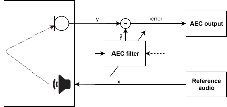
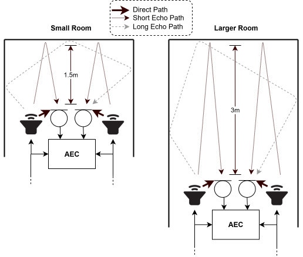

.. _aec_module:

Acoustic Echo Canceller
=======================

An acoustic echo canceller (AEC) removes signal that is played through a
device's loudspeaker, into the room, and picked up again by its microphones.
The difference between the loudspeaker signal, referred to as the
*reference signal*, and the microphone signal is used by the AEC to model the acoustic paths
between loudspeakers and microphones. Using this model, the AEC
predicts the resulting echo and subtracts it from the captured
microphone signal in real time. By eliminating this feedback, the AEC
ensures clear communication and prevents far-end listeners from hearing
their own voice echoed back.

.. _aec_filter:

    A basic AEC filter.

Overview
--------

The AEC component in ``lib_voice`` processes one or more channels of microphone
input together with one or more channels of reference input.
Microphone input is the audio captured by the device microphones.
Reference input is the audio signal sent to the device loudspeakers.
Using the reference input, the AEC estimates how sound propagates through the
acoustic environment and removes the resulting echo from the microphone signal.
The resulting output is the *error signal*, which represents the
echo-cancelled microphone signal.

Echo cancellation is performed independently for each microphone–
loudspeaker pair. For a system with *M* microphone channels and *N*
reference channels, the AEC maintains *M × N* adaptive filters, each
modeling the acoustic path from a particular loudspeaker to a
particular microphone. The filters continually adapt to the
acoustic environment to accommodate changes in the room created by
events such as doors opening or closing and people moving about.

Signal Representation
---------------------

Processing is performed on a frame-by-frame basis. Each frame consists
of 15 ms of audio, corresponding to 240 samples at a 16 kHz sampling
rate, per channel. For example, a configuration with two microphone
channels and two reference channels processes 2 × 240 samples of
microphone data and 2 × 240 samples of reference data per frame.

Adaptive Filters
----------------

The AEC uses frequency-domain adaptive filters to estimate and remove
echo. Each filter has a configurable number of phases, where the number
of phases determines the effective tail length of the filter. Longer
filters can model more reverberant acoustic environments and generally
provide improved echo suppression, at the cost of increased computation
and slower adaptation.

Two types of adaptive filters are used:

- Main filter
- Shadow filter

Each microphone-reference pair has one main filter and one shadow
filter.

The main filter is used to generate the echo-cancelled output of the AEC.
It typically has a longer tail length, allowing it to converge to a more
accurate estimate of the room impulse response and achieve deeper echo
cancellation. In larger rooms with more reverberation, a longer tail length
may be necessary to achieve good echo cancellation, as the echo path is longer. This is shown in
:numref:`aec_delay_path`.

.. _aec_delay_path:

    Echo paths from the speakers to the microphones.

The shadow filter has fewer phases and is designed to adapt more
quickly. It is used to detect changes in the acoustic environment, such
as people moving or doors opening and closing. When the shadow filter
outperforms the main filter, its coefficients can be promoted to the main filter,
allowing the AEC to respond rapidly to environmental changes.

Processing Flow
---------------

For each frame, the AEC performs the following high-level steps:

1. Transform microphone and reference signals into the frequency domain.
2. Estimate the echo contribution using the adaptive filters.
3. Subtract the estimated echo from the microphone signal to produce
   the error signal.
4. Update filter coefficients based on the error signal.
5. Transform the error signal back to the time domain to produce the
   echo-cancelled output.

Usage
-----

Before starting processing, or whenever the configuration changes, the
AEC must be initialised by calling :c:func:`aec_init()`. This sets up internal
state for a given runtime configuration (channels and number of phases).

Once initialised, echo cancellation is performed by calling
:c:func:`aec_process_frame()` for each input frame.

Examples of initialising and running the AEC using one or two hardware threads
are provided in the :ref:`aec_example`. Alternatively, refer to :ref:`pipeline_example` to see how to use AEC
as part of the :ref:`stage1_module`.

For configuration details (compile-time limits, memory pools, schedules),
see the :ref:`aec-configuration` and :ref:`aec-schedules` sections below.

.. _aec-configuration:

Configuration
-------------

The AEC is designed to support a range of runtime configurations while
avoiding dynamic memory allocation at runtime. There are two layers of configuration:

- Compile-time capacity (maximums)

  - :c:macro:`AEC_MAX_Y_CHANNELS`
  - :c:macro:`AEC_MAX_X_CHANNELS`
  - :c:macro:`AEC_MAIN_FILTER_PHASES`
  - :c:macro:`AEC_SHADOW_FILTER_PHASES`

  These macros determine the size of the memory pools and the upper bounds for runtime settings.

- Runtime configuration

  :c:func:`aec_init()` parameters: ``num_y_channels``, ``num_x_channels``,
  ``num_main_filter_phases`` and ``num_shadow_filter_phases``.
  The runtime configuration must be a :ref:`valid subset <aec-preconditions>` of the compile-time
  limits. Changing any of these parameters requires calling :c:func:`aec_init()` again to
  reinitialise the AEC state.

Memory pools
^^^^^^^^^^^^

AEC binds internal BFP structures to preallocated memory pools:

- :c:type:`aec_memory_pool_t` (main filter + shared state)
- :c:type:`aec_shadow_filt_memory_pool_t` (shadow filter)

The pools must be allocated with capacity matching the compile-time macros above.
At initialisation, :c:func:`aec_init()` maps the pools to internal BFP structures
sized to the runtime configuration.
The pools must remain valid for the lifetime of the AEC instance.

.. _aec-preconditions:

Preconditions
^^^^^^^^^^^^^

To be a valid runtime configuration, :c:func:`aec_init()` parameters -
``num_y_channels``, ``num_x_channels``, ``num_main_filter_phases``
and ``num_shadow_filter_phases`` must satisfy:

- ``num_y_channels`` ≤ :c:macro:`AEC_MAX_Y_CHANNELS`
- ``num_x_channels`` ≤ :c:macro:`AEC_MAX_X_CHANNELS`
- ``num_main_filter_phases`` ≤ :c:macro:`AEC_MAIN_FILTER_PHASES`
- ``num_shadow_filter_phases`` ≤ :c:macro:`AEC_SHADOW_FILTER_PHASES`
- Phase-pool demand does not exceed capacity:

  - Main filter:
    (``num_y_channels`` × ``num_x_channels`` × ``num_main_filter_phases``) +
    (``num_x_channels`` × ``num_main_filter_phases``) ≤
    (:c:macro:`AEC_MAX_Y_CHANNELS` × :c:macro:`AEC_MAX_X_CHANNELS` × :c:macro:`AEC_MAIN_FILTER_PHASES`) +
    (:c:macro:`AEC_MAX_X_CHANNELS` × :c:macro:`AEC_MAIN_FILTER_PHASES`)
  - Shadow filter:
    (``num_y_channels`` × ``num_x_channels`` × ``num_shadow_filter_phases``) ≤
    (:c:macro:`AEC_MAX_Y_CHANNELS` × :c:macro:`AEC_MAX_X_CHANNELS` × :c:macro:`AEC_SHADOW_FILTER_PHASES`)

.. _aec-schedules:

Schedules (work distribution)
-----------------------------

Distributing :c:func:`aec_process_frame()` work across hardware threads
is controlled by an AEC task distribution schedule (:c:type:`aec_task_distribution_t`).
The schedule is passed to :c:func:`aec_init()` via the ``tdist`` argument.

Default schedules
^^^^^^^^^^^^^^^^^
The library has pre-compiled schedules for running AEC processing of a pre-defined configuration
(:c:macro:`AEC_MAX_Y_CHANNELS` = 2 and :c:macro:`AEC_MAX_X_CHANNELS` = 2) on either 1 or 2 hardware threads:
:c:var:`aec_tdist_chans2_threads1` and :c:var:`aec_tdist_chans2_threads2`. Either of these can be passed to
:c:func:`aec_init()`.

Custom schedules
^^^^^^^^^^^^^^^^

Alternatively, a custom schedule can be generated by setting
``AEC_SCHEDULE_CONFIG`` (or ``AEC_SCHEDULE_CONFIG_<config>`` if specifying
multiple build configs in a single CMakeLists.txt) to the desired schedule
in the application's CMakeLists.txt. For example:

.. code-block:: cmake

   set(AEC_SCHEDULE_CONFIG "1 2 2 10 5")

This string encodes:

``<num_hw_threads> <max_y_channels> <max_x_channels> <max_main_phases> <max_shadow_phases>``

- ``<num_hw_threads>``: number of hardware threads (supported up to a max of :c:macro:`AEC_LIB_MAX_THREADS` hardware threads).
- ``<max_y_channels>``: compile-time maximum microphone channels (overrides :c:macro:`AEC_MAX_Y_CHANNELS`).
- ``<max_x_channels>``: compile-time maximum reference channels (overrides :c:macro:`AEC_MAX_X_CHANNELS`).
- ``<max_main_phases>``: compile-time maximum main-filter phases (overrides :c:macro:`AEC_MAIN_FILTER_PHASES`).
- ``<max_shadow_phases>``: compile-time maximum shadow-filter phases (overrides :c:macro:`AEC_SHADOW_FILTER_PHASES`).

When ``AEC_SCHEDULE_CONFIG`` is set, the compilation process autogenerates:

- A ``aec_task_distribution.c`` file containing the task distribution schedule of type :c:type:`aec_task_distribution_t` that targets
  ``<num_hw_threads>`` threads.
- A header file (``aec_conf.h``) that defines the macros above, overriding the library defaults.

The autogenerated files are added to the target sources and includes of the application target and get compiled accordingly.
The autogenerated schedule is of the form:

.. code-block:: c

   aec_task_distribution_t tdist = { ...

To use it, in the application, declare the symbol:

.. code-block:: c

   extern aec_task_distribution_t tdist;

and pass ``&tdist`` as an argument to :c:func:`aec_init()`.

.. note::
   A given schedule would work for any runtime subset (fewer y/x channels or phases) as long as
   :c:func:`aec_init()` preconditions defined in :ref:`aec-preconditions` are met.

Parameters
----------

The key AEC parameters are highlighted below:

* :c:func:`aec_init` ``num_main_filter_phases`` - Number of phases for the main filter, typically
  10-20. This determines the effective tail length of the main filter, with 15ms (240) samples per
  phase with the default :c:macro:`AEC_FRAME_ADVANCE`. More phases allow for better echo cancellation in more reverberant environments, at the
  cost of increased computation and slower adaptation.
* :c:func:`aec_init` ``num_shadow_filter_phases`` - Number of phases for the shadow filter,
  typically 5. This determines the effective tail length of the shadow filter, with 15ms (240)
  samples per phase. The shadow filter is designed to adapt more quickly than the main filter, so
  it typically has fewer phases than the main filter in order to quickly capture acoustic state
  changes.
* :c:member:`coherence_mu_config_params_t.mu_scalar` - Scalar controlling the overall rate of 
  the AEC filter adaption, set to 1.0 by default. When ``adaption_config`` is set to
  ``AEC_ADAPTION_FORCE_ON``, this value controls the rate of adaption for all frames. When
  ``adaption_config`` is set to ``AEC_ADAPTION_AUTO``, this value controls the relative rate of
  adaption. Values less than 1.0 will slow down the rate of adaption, which can improve stability
  in some environments, at the cost of slower convergence. Values greater than 1.0 will speed up
  the rate of adaption, which can improve convergence speed but may reduce stability and
  attenuation.
* :c:member:`coherence_mu_config_params_t.erle_thresh` - The AEC adaption will be paused when the
  estimated ERLE (Echo Return Loss Enhancement) drops by this much relative to the long term
  average. Increasing this value can improve convergence in noisy environments, at the cost of
  increased deconvergence during near end noise or speech.
* :c:member:`coherence_mu_config_params_t.coh_thresh_abs` - Sets the minimum coherence threshold
  for AEC adaption. The coherence is measured between the microphone signal and the estimated
  microphone signal. When the coherence is below this threshold, the AEC filters will not adapt.
  Decreasing this value can allow for faster convergence in noisy environments, at the cost of
  increased deconvergence during near end noise or speech.
* :c:member:`coherence_mu_config_params_t.coh_thresh_slow` - Sets the relative coherence threshold
  for the current frame against the slow moving average. Reducing this value will allow frames with
  lower coherence than the average to adapt, which can improve convergence in noisy environments,
  at the cost of increased deconvergence during near end noise or speech.
* :c:member:`coherence_mu_config_params_t.adaption_config` - Configures the adaption behaviour of
  the AEC. When set to ``AEC_ADAPTION_AUTO``, the AEC will automatically adjust the adaption rate
  based on the coherence and ERLE thresholds above. When set to ``AEC_ADAPTION_FORCE_ON``, the AEC
  will adapt on every frame regardless of the coherence or ERLE. When set to
  ``AEC_ADAPTION_FORCE_OFF``, the AEC will not adapt on any frames.
* :c:macro:`REF_ACTIVE_THRESHOLD_DB` - This macro sets the threshold for determining whether the
  reference signal is active, in decibels relative to full scale. When the maximum value of the 
  reference signal in a frame is below this threshold, the AEC will consider it inactive and will
  pause adaption. If the reference signal is expected to be far below full scale for a reasonable
  SPL output, this threshold can be reduced to allow for adaption during low-level playback.
  
Other AEC parameters are described in the ``aec_state.h`` header file, and are described in detail in
:c:struct:`aec_config_params_t`.