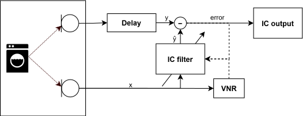

.. _`ic_module`:

Interference Canceller
======================

An interference canceller (IC) removes unwanted point noise sources such as cooker hoods, washing
machines, or radios for which there is no reference audio signal available.
It achieves this by adapting a filter to cancel one microphone with the other. The filter is only
updated when speech is not present, which allows the filter to converge to cancel the noise sources
in the room. When speech occurs, the filter is held constant, which allows the speech to pass
through while maintaining suppression of the noise sources. 
The IC uses the :ref:`vnr_module` to detect when speech is present.
A delay line is used to improve the causality of the IC filter by moving the peak towards the middle
of the filter taps.

.. _ic_basics:

    The IC filter topology.

Overview
--------

The IC component in ``lib_voice`` processes two microphone channels and attempts to cancel
one microphone signal from the other in the absence of voice.

It builds an estimate of the difference in transfer functions between the two
microphones for any present noise sources.
Since the transfer function includes spatial information about the noise
sources, applying this filter to the mic input allows any signals originating
from the noise source to be cancelled.
It uses the :ref:`vnr_module` for detecting presence or absence of voice.
When the VNR indicates absence of speech, the IC adapts its filter to remove noise from the environment.
When the VNR indicates the presence of voice, the IC suspends adaptation which allows the voice source to be passed but
maintains suppression of the interfering noise sources which have been previously adapted to.
The IC operates at a fixed 16 kHz sample rate and produces a single output
channel.

Signal representation
---------------------

Processing is performed on a frame-by-frame basis. Each frame consists of 15 ms
of new audio samples (240 samples at 16 kHz) per input channel, with a total of 2 input channels.
Input data is expected in fixed-point 32-bit, 1.31 format. The output
is the interference-cancelled primary microphone signal, in the same 32-bit, 1.31
format.

Adaptive filter
---------------

The IC uses an adaptive filter which continually adapts to the acoustic environment to
accommodate changes in the room created by events such as doors opening or closing
and people moving about. However, it will hold the current transfer
function in the presence of voice meaning it does not adapt to desired audio sources,
which can be a person speaking.
The IC filter has 10 phases, which effectively determines the tail length of the filter.

Processing flow
---------------

For each frame, the IC performs the following steps:

1. Transform microphone signals into the frequency domain.
2. Estimate the interference using the adaptive filter.
3. Subtract the estimated interference from the primary microphone signal to produce the error signal.
4. Update the filter coefficients if the VNR indicates no speech.
5. Transform the error signal back to the time domain to produce the
   interference-cancelled output.

Usage
-----

Before starting processing, the IC must be initialised by calling
:c:func:`ic_init()`, which sets up internal state of the IC.
Once initialised, interference cancellation is performed by calling :c:func:`ic_process_frame()`
for each input frame (see :ref:`pipeline_example`). :c:func:`ic_process_frame()` also outputs
the VNR estimate for the current frame.

Parameters
----------

The key IC parameters are highlighted below:

* :c:member:`ic_adaption_controller_config_t.input_vnr_threshold` - If the VNR estimate for the current frame is above this
  threshold, the IC will suspend adaptation of its filter coefficients. This allows the IC to
  maintain suppression of noise sources while allowing speech to pass through. Lowering this
  threshold will cause the IC to adapt less often, which may reduce the amount of noise suppression
  but will allow more speech to pass through. This may be desirable in environments with higher
  levels of diffuse noise, which cannot be cancelled by the IC.
* :c:member:`ic_adaption_controller_config_t.input_vnr_threshold_high` - If the microphone VNR estimate for the current frame is
  above this threshold, this indicates that the noise in the room is low, and the IC is not needed.
  The IC will suspend adaptation of its filter coefficients and will also leak the filter
  coefficients to reduce the amount of noise suppression applied to the output.
  This allows more speech to pass through at the cost of reduced noise suppression. Lowering this
  threshold will cause the IC to adapt less often, which may reduce the amount of noise suppression
  but will allow more speech to pass through.
* :c:macro:`IC_Y_CHANNEL_DELAY_SAMPS` - The ideal filter for the interference canceller is the
  deconvolution of the impulse responses between the noise source and each of the two microphones.
  This filter is non-causal, and the delay between the channels allow the IC to adapt to the ideal
  filter. However, this adds latency, which can be reduced by reducing `IC_Y_CHANNEL_DELAY_SAMPS`, 
  at the cost of reduced IC performance.

Other IC parameters are described in the ``ic_state.h`` header file, and are described in detail in
:c:struct:`ic_adaption_controller_config_t`.