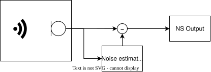

Noise Suppressor
=================

The Noise Suppressor (NS) reduces stationary noise in an audio signal so that
speech is clearer and easier to process. It estimates the noise present in the
signal and attenuates it in the frequency domain, producing a cleaner output.

.. _ns_basics:

    The Noise Suppressor topology.

Overview
--------

The NS operates in the frequency domain, continuously estimating noise and
adapting to changing conditions.
It continuously estimates the noise spectrum by tracking the smoothed input
spectrum and its local minima, adapting the smoothing rate based on the
probability of speech presence. The estimated noise is subtracted from the
input spectrum (spectral subtraction), and the resulting signal is transformed
back to the time domain for output.

The NS component in ``lib_voice`` works on a single input channel.
If multiple channels need to be processed by the application, or multiple outputs
are required, an independent instance of the NS must be run for each channel.

Signal representation
---------------------

Noise suppression is performed on a frame-by-frame basis.
Each frame consists of 15 ms of audio (240 samples at 16 kHz input sampling rate),
with input data expected in fixed-point 32-bit 1.31 format.
The output is the noise-suppressed signal in the same format.

Usage
-----

Before processing any frames, the application must configure and initialise the
NS instance by calling :c:func:`ns_init()`. Then for each frame,
:c:func:`ns_process_frame()` will update the NS instance's internal state and produce
the output frame by applying the NS algorithm to the input frame.
Refer to the :ref:`pipeline_example` to see how the APIs above are used.

Parameters
----------

The Noise Suppressor has no user configurable parameters.