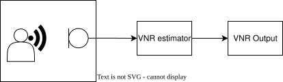

.. _vnr_module:

Voice to Noise Ratio estimator
==============================

The Voice to Noise Ratio estimator (VNR) estimates the signal to noise ratio of a speech signal in noise, using a pre-trained neural network.
The VNR neural network model outputs a value between 0 and 1, with 1 indicating the strongest speech, and 0,
the weakest speech compared to noise in a frame of audio data. A VNR value of 0.5 indicates a 
voice to noise ratio of -5 dB.

VNR estimations can be very helpful in voice processing pipelines.
Applications for VNR include intelligent power management,
control of adaptive filters for reducing noise sources in the :ref:`ic_module`, and improved performance of the :ref:`agc_module`
blocks that provide a more natural listening experience.

The VNR operates on short frames of audio, transforming the input into the
frequency domain and compressing it with a MEL filterbank. Features from the
most recent frames are then fed into a pre-trained neural network that outputs
the VNR estimate.

The VNR model is a pre-trained TensorFlow Lite model, optimised for the XCORE platform.

.. _vnr_basics:

    The VNR topology.

Overview
--------

The VNR module processes :c:macro:`VNR_FRAME_ADVANCE` new audio PCM samples every frame.
The time domain input is transformed to frequency domain using a :c:macro:`VNR_PROC_FRAME_LENGTH` point DFT.
A MEL filterbank is then applied to compress the DFT output spectrum into fewer data points.
The MEL filter outputs of :c:macro:`VNR_PATCH_WIDTH` most recent frames are normalised and fed as input features
to the VNR prediction model which runs an inference over the features to output the VNR estimate value.

Basic Usage
-----------

To use the high-level API, initialise the VNR state by calling :c:func:`vnr_state_init()`.
Then, for each frame, call :c:func:`vnr_process_frame()` to update VNR's internal state and produce VNR estimate.
Refer to the :ref:`vnr_example` to see how to initialise and run the VNR using the basic API.

Advanced Usage
--------------

The low-level API separates feature extraction from inference to allow
multiple sets of features to share the same inference engine.

The VNR feature extraction is further split into 2 parts:
a function to form the input frame that the feature extraction can run on, and a function to do the actual feature extraction.
The function for forming the input frame starts from :c:macro:`VNR_FRAME_ADVANCE` new PCM samples and creates the DFT output
that is used as input to the MEL filterbank.
This has been separated from the rest of the feature extraction to support cases where the VNR
might be using the DFT output computed in another module for extracting features.

Before starting the feature extraction, the user must call :c:func:`vnr_input_state_init()`
and :c:func:`vnr_feature_state_init()` to initialise the form input frame and feature extraction state.
Before starting inference, the user must call :c:func:`vnr_inference_init()` to initialise the inference engine.

There are no user configurable parameters within the VNR and so no arguments are required and no configuration structures need be tuned.

Once the VNR is initialised, the :c:func:`vnr_form_input_frame()`, :c:func:`vnr_extract_features()` and :c:func:`vnr_inference()` functions should be called on a frame by frame basis.

Refer to the IC source code to see how to initialise and run the VNR using the advanced API.

Parameters
----------

The VNR has no user configurable parameters.